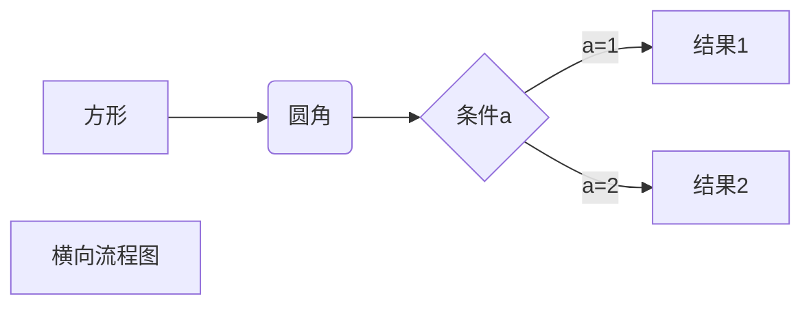
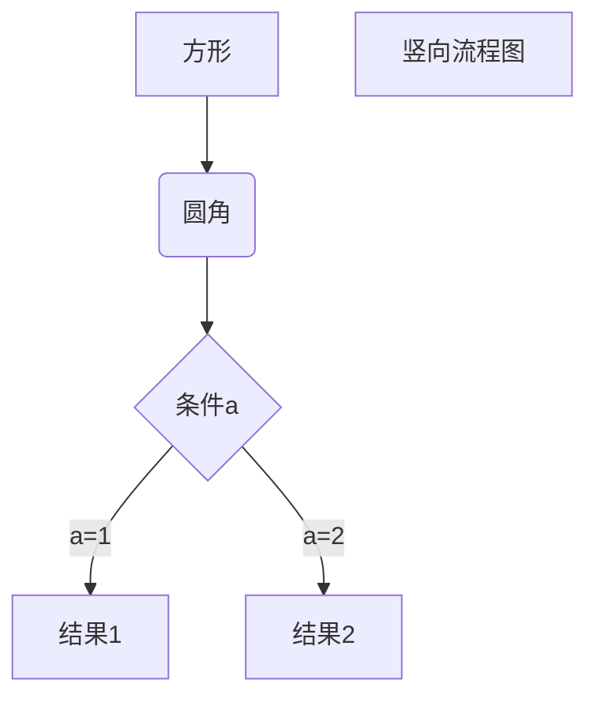

Markdown学习
=============

wzk
------

一级标题
=======
二级标题
------------

# 一级标题
## 二级标题
### 三级标题

换行是两个以上空格加回车  
否则不换行
比如这样  
或者用空行积极积极军军军军军军军军军军军军军军军军军军军军军军军军军军军军军军军军军军军军军军军军军军军军军军军军军军军军军军军军军军军军
比如这样

# 字体
*斜体文本*
_斜体文本_
**粗体文本**
__粗体文本__
**_粗斜体文本_**
~~删除线~~
<u>下划线</u>


# 分割线
分割线：
***
* * *
- - -
--------

# 脚注
[^RUNOOB]。
[^RUNOOB]: 菜鸟教程 -- 学的不仅是技术，更是梦想！！！

# 列表

+ 第一项
+ 第二项
+ 第三项

1. 第一项
2. 第二项
3. 第三项

列表嵌套
1. 第一项
	- 第一个元素
	- 第二个元素
2. 第二项
	- 第一个元素
	- 第二个元素

# 区块
> 区块
> 嵌套区块
>
> > 123

# 代码
'printf()'引用片段代码

	< 代码区段
	print("Hello World")

```python
	printf("test")
```


# 链接
[百度](www.baidu.com)

直接使用网址<www.github.com>

# 图片：


或者使用网址变量 [runoob][1]

在文章结尾赋值
[1]: http://static.runoob.com/images/runoob-logo.png


html方法设定宽度


# 表格
|  表头   | 表头  |
|  ----  | ----  |
| 单元格  | 单元格 |
| 单元格  | 单元格 |

| 左对齐 | 右对齐 | 居中对齐 |
| :-----| ----: | :----: |
| 单元格 | 单元格 | 单元格 |
| 单元格 | 单元格 | 单元格 |

# 转义字符
\*  \\  \+  \(  \)  .... 


# 流程图




# 数学公式

$$
\mathbf{V}_1 \times \mathbf{V}_2 =  \begin{vmatrix} 
\mathbf{i} & \mathbf{j} & \mathbf{k} \\
\frac{\partial X}{\partial u} &  \frac{\partial Y}{\partial u} & 0 \\
\frac{\partial X}{\partial v} &  \frac{\partial Y}{\partial v} & 0 \\
\end{vmatrix}
{\style{visibility:hidden}{(x+1)(x+1)}}
$$
